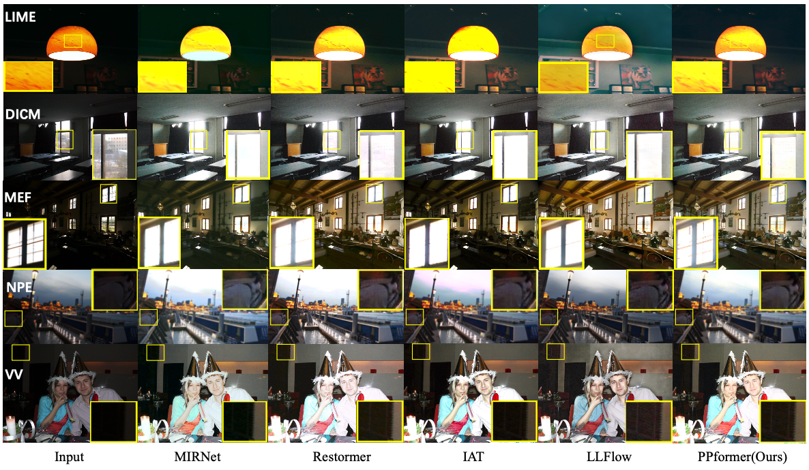

# [CVIU] [PPformer: Using pixel-wise and patch-wise cross-attention for low-light image enhancement](https://www.sciencedirect.com/science/article/abs/pii/S1077314224000110)  

## [Jiachen Dang](https://github.com/DenijsonC), Yong Zhong, Xiaolin Qing
[](https://www.sciencedirect.com/science/article/abs/pii/S1077314224000110)
#### News
- **02.24, 2024:** Codes and weights have been released. Feel free to use them. 🚀⭐
- **01 08, 2024:** Our paper has been accepted by ‘Computer Vision and Image Understanding’ (CVIU). Code and Models will be released. 🎉
<hr />

> **Abstract:** * Recently, transformer-based methods have shown strong competition compared to CNN-based methods on the low-light image enhancement task, by employing the self-attention for feature extraction. Transformer-based methods perform well in modeling long-range pixel dependencies, which are essential for low-light image enhancement to achieve better lighting, natural colors, and higher contrast. However, the high computational cost of self-attention limits its development in low-light image enhancement, while some works struggle to balance accuracy and computational cost. In this work, we propose a lightweight and effective network based on the proposed pixel-wise and patch-wise cross-attention mechanism, PPformer, for low-light image enhancement. PPformer is a CNN-transformer hybrid network that is divided into three parts: local-branch, global-branch, and Dual Cross-Attention. Each part plays a vital role in PPformer. Specifically, the local-branch extracts local structural information using a stack of Wide Enhancement Modules, and the global-branch provides the refining global information by Cross Patch Module and Global Convolution Module. Besides, different from self-attention, we use extracted global semantic information to guide modeling dependencies between local and non-local. According to calculating Dual Cross-Attention, the PPformer can effectively restore images with better color consistency, natural brightness and contrast. Benefiting from the proposed dual cross-attention mechanism, PPformer effectively captures the dependencies in both pixel and patch levels for a full-size feature map. Extensive experiments on eleven real-world benchmark datasets show that PPformer achieves better quantitative and qualitative results than previous state-of-the-art methods. 
<hr />

<details close>
<summary><b>Pipeline</b></summary>


</details>

## Installation

See [INSTALL.md](INSTALL.md) for the installation of dependencies required to run PPformer.

## Quick Run (Demo) 

Test on the local environment:  

To test the pre-trained models for enhancing your images, run
```
cd basicsr

python demo.py --input_dir images_folder_path --result_dir save_images_here --weights path_to_models
```
**All pre-trained models can be found in the folder "checkpoints/$<$dataset$>$"

## Train  
Training for Image Enhancement is provided in <a href="basicsr/TRAINING.md">TRAINING.md</a></td>. Here is a summary table containing hyperlinks for easy navigation:

<table>
  <tr>
    <th align="left">Model</th>
    <th align="center">LOL | </th>
    <th align="center">FiveK | </th>
    <th align="center">SID | </th>
  </tr>
  <tr>
    <td align="left">PPformer</td>
    <td align="center"><a href="checkpoints/LOL">weights | </a></td>
    <td align="center"><a href="checkpoints/5k">weights | </a></td>
    <td align="center"><a href="checkpoints/SID">weights | </a></td>
  </tr>
</table>

## Dataset
For the preparation of the datasets, see [datasets/README.md](datasets/README.md).  

## Test (Evaluation)  
 
- To test the PSNR, SSIM and LPIPS of *image enhancement*, see [evaluation.py](./evaluation.py) and run
```
cd basicsr

python evaluation.py -dirA images_folder_path -dirB images_folder_path -type image_data_type --use_gpu use_gpu_or_not
```

## Result  

<details close>
<summary><b>Quantitative Evaluation.</b></summary>


 


</details>  

<details close>
<summary><b>Qualitative Evaluation.</b></summary>


 


</details>  

## Citation  

```
@article{DANG2024,
title = {PPformer: Using pixel-wise and patch-wise cross-attention for low-light image enhancement},
journal = {Computer Vision and Image Understanding},
volume = {241},
pages = {103930},
year = {2024},
issn = {1077-3142},
doi = {https://doi.org/10.1016/j.cviu.2024.103930},
url = {https://www.sciencedirect.com/science/article/pii/S1077314224000110},
author = {Jiachen Dang and Yong Zhong and Xiaolin Qin},
keywords = {Low-light image enhancement, Cross-attention, Lightweight, CNN-transformer hybrid network}
}
```
## Contact
Should you have any questions, please contact dj.chen112@gmail.com


**Acknowledgment:** This code is based on the [BasicSR](https://github.com/xinntao/BasicSR) toolbox. 
